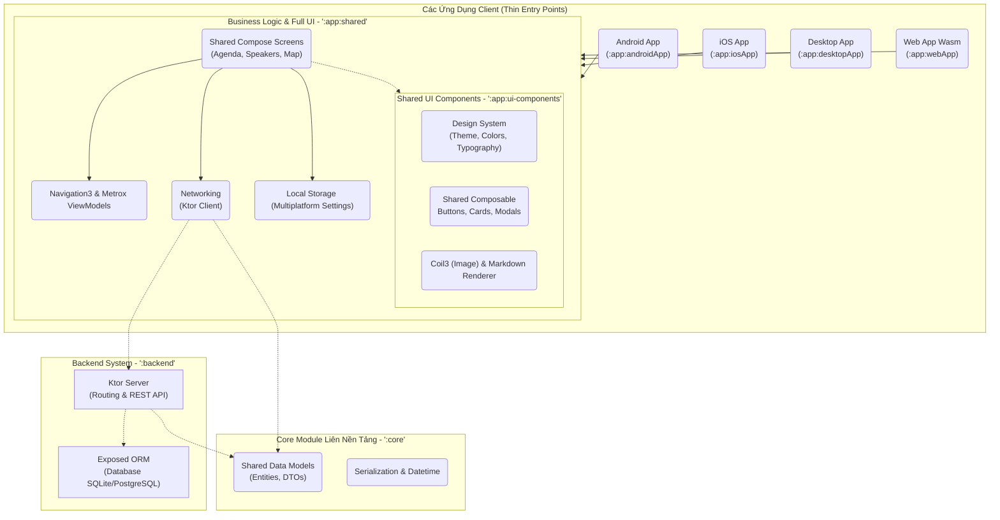

# Phân Tích Kiến Trúc Dự Án KotlinConf App

**KotlinConf App** là dự án mẫu chính thức của JetBrains (Official Sample) được dùng trong hội nghị phát triển Kotlin thường niên. Khác với `PeopleInSpace` (giữ lại SwiftUI cho tầng View của iOS), kiến trúc của **KotlinConf App** trình diễn sức mạnh tối thượng của hệ sinh thái Kotlin: **Chia sẻ mọi thứ**, bao gồm toàn bộ Data, Logic, Backend và **100% Giao diện (Shared UI)** trên đa nền tảng nhờ Compose Multiplatform.

Dưới đây là một phân tích chi tiết toàn bộ kiến trúc và các thành phần của dự án này.

## 1. Sơ Đồ Kiến Trúc Tổng Quan (Architecture Overview)

## 2. Các Modules Trong Dự Án

### 2.1 `:core` (Core Module Dùng Chung Backend & Client)
Module chứa các Data Classes (Model, DTO) mang tính cốt lõi nhất.
- Nó được dùng chung bởi cả Data Layer của Front-end (Client) và của **Backend**. Nhờ đó nếu API thay đổi data field, chỉ cần sửa ở 1 nơi, cả logic Client và Server đều được compile lại an toàn theo Type-Safe.
- Sử dụng `kotlinx-serialization` và `kotlinx-datetime` thuần Kotlin.

### 2.2 `:backend` (Máy Chủ)
Hệ thống Backend (Server-side) cung cấp API cho ứng dụng hiển thị thông tin về diễn giả, lịch trình KotlinConf.
- Khác hoàn toàn cách dev Backend truyền thống (NodeJS/Java Spring), đoạn code API này viết hoàn toàn bằng Kotlin, dùng Framework **Ktor Server**.
- Việc truy vấn Database được xử lý bằng ORM **Exposed** (thư viện DB chính thức từ JetBrains).

### 2.3 `:app:ui-components` (Thư Viện Code UI Chia Sẻ)
Thay vì code UI trực tiếp vào từng nền tảng, đây là nơi xây dựng hệ thống **Design System** cho toàn bộ 4 app (Mobile + Desktop + Web).
- **Core Technology**: Sử dụng **Compose Multiplatform**.
- Quản lý Resources dùng chung (`composeResources`): Ảnh, Fonts, Strings.
- Chứa logic hiển thị giao diện động như Markdown Renderer và load ảnh bất đồng bộ với thư viện `Coil3` bản multiplatform.

### 2.4 `:app:shared` (Mạch Máu & Dàn Nhạc Chính Của App)
Thay vì chỉ chứa API và Database như mô hình KMP thông thường, với kiến trúc Compose UI thì module `shared` này "nuốt" trọn luôn cả toàn bộ Màn Hình (Screens), Navigation và States của ứng dụng. Modules này gộp `:app:ui-components` và `:core` lại.
- **Networking**: **Ktor Client** để call API từ nhánh `:backend`.
- **Local Cache**: Khác với PeopleInSpace dùng SQLDelight cho caching phức tạp, KotlinConf ứng dụng `Multiplatform Settings` để lưu cache/key-value cục bộ nhanh và gọn nhẹ hơn cho các tuỳ chỉnh User.
- **State Management**: Sử dụng hệ thống ViewModels multiplatform (`metrox` + lifecycle runtime).
- **Navigation**: Sử dụng `androidx.navigation3` kết hợp với Compose để điều hướng người dùng (chuyển màn hình) dùng chung thẳng cho cả Android iOS Web mà không cần phải viết điều hướng native bọc ở bên ngoài.

### 2.5 Các Ứng Dụng Client Đích (Frontends)
Điểm đáng nể của kiến trúc này là các module đích của nền tảng (Thin Entry Points) như `:app:androidApp` hay thư mục Xcode cho iOS gần như là các "vỏ rỗng" chứa đúng 1 hàm `setContent` duy nhất để load UI từ `:app:shared` qua.

- **`androidApp`**: Native Android app. Cung cấp context và gọi `MainViewController`.
- **`iosApp`**: Project Xcode dùng Swift. Dòng code `ComposeUIViewController` được sinh ra từ module `shared` sẽ vẽ toàn bộ UI Compose đó thẳng lên màn hình iPhone thông qua Canvas. (Mô hình Fully-Shared UI).
- **`desktopApp`**: Cho Windows/macOS/Linux thông qua Compose Desktop JVM.
- **`webApp`**: Phiên bản duyệt trình biên dịch nhị phân với **WebAssembly (WasmJS)** siêu hiện đại cho tốc độ chạy siêu mượt tương đương native.

---

## 3. Tại Sao Lại Là Kiến Trúc Này?

So với kiến trúc **PeopleInSpace** (KMP chia sẻ Logic, giữ Native View cho Apple), kiến trúc của **KotlinConf App** đại diện cho **kỷ nguyên thứ 2 của lập trình ứng dụng Cross-Platform** đến từ JetBrains:

1. **Write Once, Run Everywhere (Thực sự):** Khác biệt rõ rệt so với Flutter/React Native, mô hình KMP Compose vẫn dùng UI native Compose rendering framework tuỳ biến cho Desktop và Mobile, đồng thời mang theo trọn bộ cơ chế Backend vào chung hệ sinh thái Kotlin.
2. **Khái niệm "Trọn Gói":** Mọi thứ bạn thấy trong app: cái nút (Button), hộp thoại gõ chữ (TextField), hiệu ứng chuyển cảnh (Animation), tải dữ liệu (Network) — mọi thứ đều code 1 lần duy nhất trong `:app:shared` và chạy y chang trên Browser, Windows PC, iOS và Android.
3. **Mô Hình Lý Tưởng Cho Startup/Enterprise:** Sự đồng bộ giữa `:core` Model DTO -> `Backend Ktor` -> `Client Shared` tiết kiệm được lượng khổng lồ thời gian đồng bộ Document API và thời gian viết mã các hệ thống UI/UX design components trùng lặp thường gặp. 

**Kết quả:** JetBrains đang dùng chính dự án KotlinConf App làm lá cờ đầu đi chứng minh sức mạnh của mô hình Fully Shared UI.
